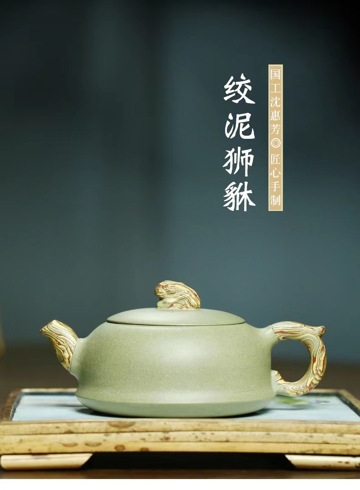
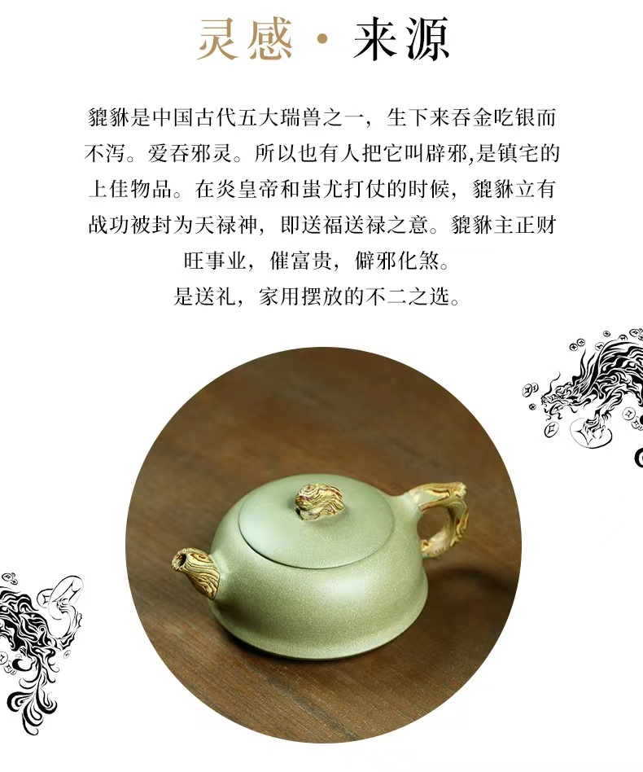
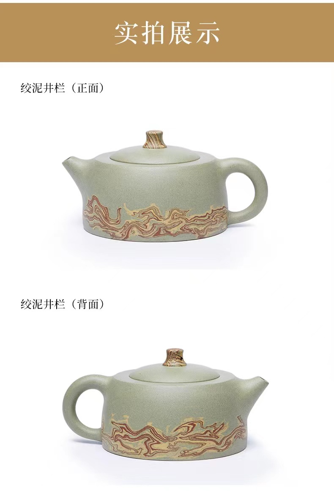
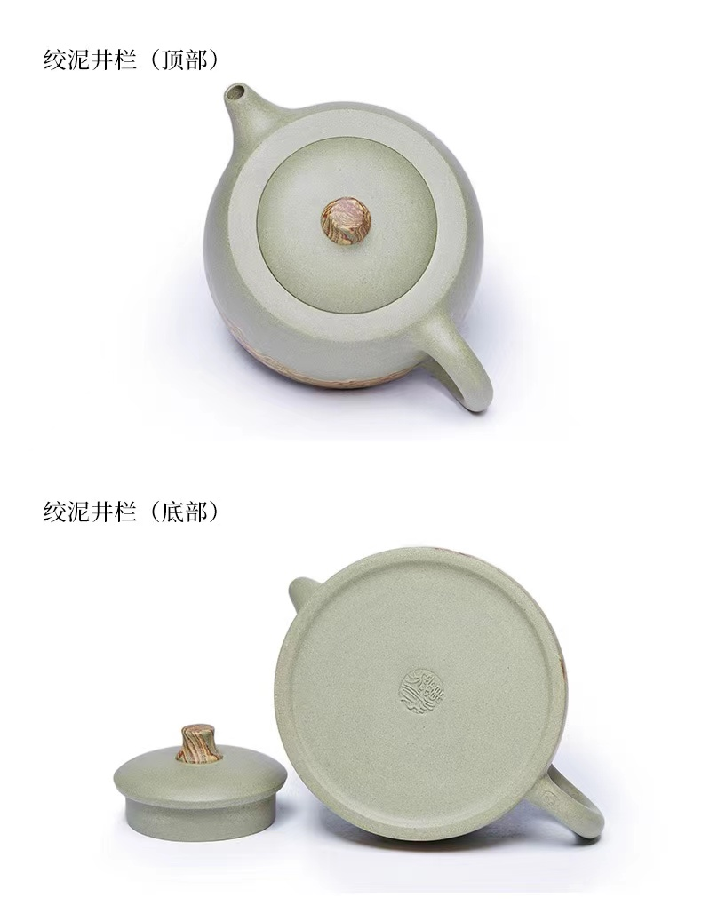

# 绞泥

[目录](/README.md)

[上一级](../README.md)

&#8195;&#8195;运用两种或两种以上不同颜色的泥料相互柔和、挤压形成自然纹路（如类似云纹、水波纹、旋纹、编织纹等）的陶瓷装饰技法。
&#8195;&#8195;绞泥工艺发源于唐代，是唐代绞胎工艺与紫砂制壶工艺的结合，体现了我国制壶工艺的最高水平，日本、韩国都有类似的工艺，只是此工艺传入日本和韩国比较晚，因此这种工艺的表现形式方面相比较与我国就比较少，仅有瓷器作品。
&#8195;&#8195;在我国绞泥的瓷器作品，我们称之为绞胎，主要产地在河南焦作，绞泥紫砂主要产地在宜兴，此工艺难度较大，因此宜兴也很少有从事这种工艺的工匠，比较有名的绞泥艺术家有宜兴的吕尧臣、焦作的杨峡等，他们的作品比较新颖，在继承传统工艺的同时，融入了很多新的设计元素。吕尧臣作品沉稳大气，杨峡的作品创意十足、用色大胆，是我国绞泥工艺的继承者和开拓者。
&#8195;&#8195;一件好的绞泥作品，既要有好的造型设计，又要有好的纹饰设计，同时因为工艺难度比较大，工匠本身又有局限性，因此很多好的绞泥作品都出自设计师与工匠的完美合作。可以说没有好的设计师的参与，不可能做出好的绞泥作品，没有熟练的工匠，即使设计再好看也不能做出绞泥精品，国内专业的绞泥设计工作室并不多，相信随着制作工艺的成熟，专门制作绞泥的设计工作室会不断的涌现，甚至有一些工业设计师也会被绞泥艺术所吸引，跨界做绞泥紫砂的设计。

[上一级](../README.md)
